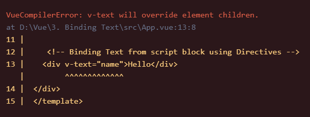

# Binding Text
```
Before starting, I am going to delete components folder and code in Template and Script block of App.vue.

As a beginner, we will be working in App.vue file so we don't have to manage multople files.
```

There are two ways to bind text in vue:
1. Mustache syntax
1. Using v-text Directive

## Mustache syntax
`<div>Hello {{name}}!</div>`

You can also use multiple data string in this like,

`<div>{{greet}} {{name}}!</div>`

**If you want to update values dynamically then using mustache is recommended as it is faster.**
## Using v-text Directive
`<div v-text="name"></div>`

You can also use multiple data string in this like,

`<div v-text="greet+name"></div>`

There is drawback of v-text Directive that if there is a text inside div, it will throw an error instead of overwriting it, like

`<div v-text="name">Hello</div>`

