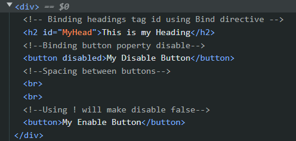

# Binding to Attributes
We can use `v-bind` directive to bind the attributes of tag like for bind any tag id you can use `v-bind:id` or for button disabled attribute you can use `v-bind:disabled`.

This feature can help us to dynamically change our attributes.

To check the working for our code, you can inspect elements,

So, here we can see our heading has assigned an id and button disabled attribute is set to `disabled` where it is true.

