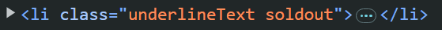

# Binding Classes
Binding Classes using directives help us to assign and change classes dynamically based on conditions.

`<h2 v-bind:class="headingClass">This is Dynamic class Assigned</h2>
`

This will bind `headingClass` as follows if we inspect,


We can also assign static and dynamic classes together as below,

`<h2 class="underlineText" v-bind:class="headingClass">This is Dynamic and Static class both Assigned</h2>`


## Conditional Binding
We can also assign classes based on conditions using directives,

`<li v-bind:class="isPromoted && 'underlineText'">Promoted</li>`

This will bind class `underlineText` if the value of `isPromoted` is true (true in our case), like below


Let's have a scenario of soldout and available products. We want soldout products in red and available in green. Here, comes the concept of conditional binding using ternity operators.
```
      <li v-bind:class="isSoldout ? 'soldout' : 'available'">Soldout Movie</li>
      <li v-bind:class="!isSoldout ? 'soldout' : 'available'">Available Movie</li>
```
In first item, we have `isSoldout` true so it must bind `soldout` class. And `available` class for second as `isSoldout` is false.


## Assigning Multiple Dynamic Classes
### Using Arrays
`<li v-bind:class="['underlineText' , 'available']">Available & Promoted Movie</li>`

Above line will assign both `underlineText` and `available` classes to item.


We can also use conditions in arrays,

`<li v-bind:class="[isPromoted && 'underlineText' , isSoldout ? 'soldout' : 'available']">Not Available But Promoted Movie</li>`

It will apply `underlineText` is `isPromoted` and `soldout` or `available` with rescept to value of `isSoldout`.


### Using Objects
We can bind multple classes with objects, using `key` and `value` pairs, `keys` will be our classes and `values` will be `true` or ` false`. If value is `true` class will be binde else not.

```
<li v-bind:class="{
      'underlineText':isPromoted,
      'available':!isAvailable,
      'soldout':isSoldout,
     }">Not Available But Promoted Movie</li>
    
```
In above case, `isPromoted` is `true` so `underlineText` will be applied, `isAvailable` is `false` so `available` will not be applied and `isSoldout` is `true` so `soldout` will also be applied.

